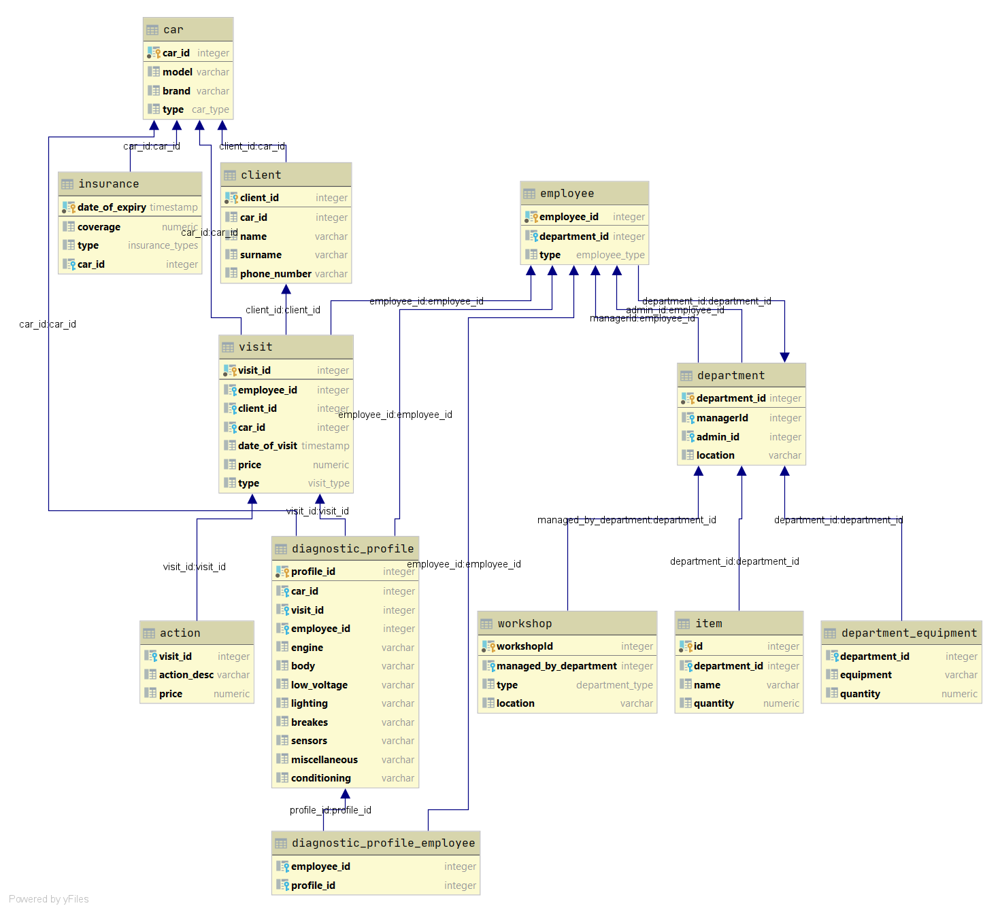

# SE-database

Database for Software Engineering project.

## Setting up local instance

In order to launch it properly, docker and docker-compose are required.
While in location of `docker-compose.yml` file invoke:

`docker-compose up`

## Auto generated schema of database

## Disclamer

**Passwords used in configuration must be changed in production environment!**
